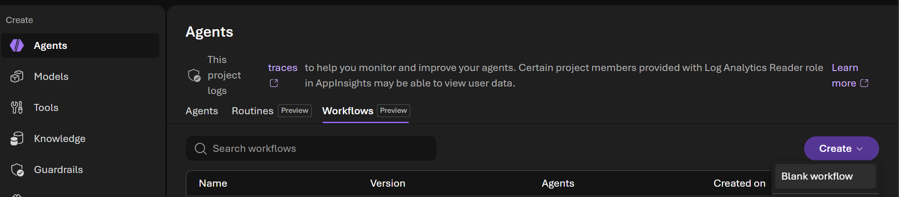
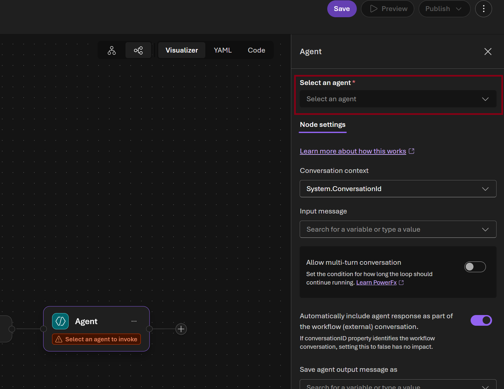
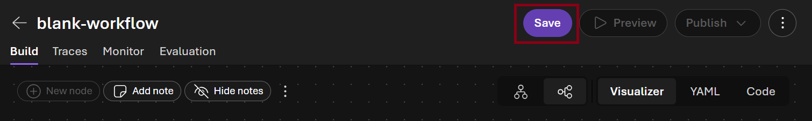
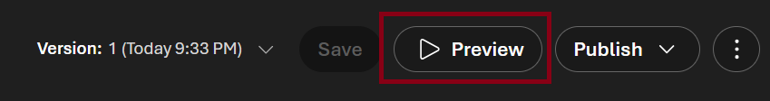

# Challenge 4: Production Workflow

Time: ~20 minutes

Build a multi-agent orchestration workflow for NovaTel Communications and take it to production.

## Scenario

The individual agents you built in Challenge 1 are valuable — but in production, agents need to work
**together** as an automated pipeline. In this challenge you wire the two agents into a full
call center triage workflow, run it from code, then build and test it visually in the Foundry portal.


## Learning Objectives

- Deploy persistent production agents (create once, reuse forever)
- Orchestrate multiple agents step-by-step in a Python workflow
- Build the same workflow visually in the Foundry portal
- Invoke the portal workflow from Python with live streaming
- View run history and traces in the portal

## The Workflow

```
ensure_agents_deployed()
        |
        v
run_intent_classification()     <-- Intent Agent classifies all 7 calls
        |
        v (for each high-priority call)
run_resolution_advisory()       <-- Resolution Agent recommends actions
        |
        v
print_shift_report()            <-- Consolidated Shift Report
```

---

## Part 1 — SDK: Build and Run the Python Workflow

### Step 1: Review the implementation

Open [deploy.py](./deploy.py) and review:

- **`ensure_agents_deployed()`** — lists existing agents, creates `intent-classification-agent` and `resolution-advisor-agent` if not present
- **`run_intent_classification()`** — calls the intent agent, handles the `lookup_customer` function call loop
- **`run_resolution_advisory()`** — calls the resolution agent for each high-priority call
- **`run_call_center_workflow()`** — orchestrates all steps and returns the consolidated report

### Step 2: Run the workflow

```bash
cd callcenter/challenge-4-deploy
python deploy.py
```

Expected output:
```
=== Step 1: Ensure Agents Are Deployed ===
  Found existing: intent-classification-agent
  Found existing: resolution-advisor-agent

=== Step 2a: Intent Classification ===
  CALL-001: billing_dispute (HIGH) — frustrated, retention risk HIGH
  CALL-002: technical_issue (HIGH) — frustrated, retention risk MEDIUM
  CALL-003: cancellation (HIGH) — neutral, retention risk HIGH
  CALL-004: upsell_opportunity (MEDIUM) — positive, retention risk LOW
  CALL-005: account_support (LOW) — frustrated, retention risk LOW
  CALL-006: billing_dispute (HIGH) — frustrated, retention risk MEDIUM
  CALL-007: security_concern (CRITICAL) — anxious, retention risk MEDIUM

=== Step 2b: Resolution Advisory (High-Priority Calls) ===
  Resolving CALL-007 (security_concern)...
  Resolving CALL-001 (billing_dispute)...
  Resolving CALL-003 (cancellation)...

NOVATEL CALL CENTER — SHIFT REPORT
  Total calls processed  : 7
  Critical priority      : 1
  High priority          : 2
  ...
```

---

## Part 2 — Portal: Build and Test the Visual Workflow

### Step 3: Verify agents are deployed in the portal

1. Open the [Microsoft Foundry portal](https://ai.azure.com/nextgen)
2. Select your project
3. Select **Build** → **Agents** in the top bar
4. Confirm both agents appear:
   - `intent-classification-agent`
   - `resolution-advisor-agent`


### Step 4: Build the workflow in the portal designer

1. Select **Build** → **Agents** → **Workflows**
2. Notice that the workflow created using the SDK in Part 1 is listed. Let's create a new workflow by selecting **Create** → **Blank workflow**



3. In the visual designer **Add a workflow node** dialog choose **Agent**

   

4. In the **Select an agent** picker select `intent-classification-agent`

   

5. In the **Next node** picker select **Agent** and click **Done** button
   \
    

6. Select the new agent node in the canvas and in the **Select and agent** picker select `resolution-advisor-agent`

    

7. In the **Next node** picker select **End** and click **Done** button

     

8. Select **Save** and name it `callcenter-triage-workflow-portal`

 

### Step 5: Test the workflow in the portal playground

> **Why you must include the call data in your message**
>
> The agents use a `lookup_customer` tool that reads from a local Python file.
> The portal playground **cannot execute Python functions** — if you send a generic
> prompt, the agent will try to call the tool and stall waiting for a result that
> never arrives. Paste the call data directly into your message so the agents can
> work without needing the tool.

1. Open **callcenter-triage-workflow-portal** → **Preview**

 

2. Paste the following message (data is pre-embedded so no tool calls are needed):

   ```
   All call data for today is below — analyse it directly, do not call lookup_customer.

   CALL-001 | Maria Gonzalez | premium | 36 months
   Unexpected $47.99 charge for sports add-on she never subscribed to. Wants refund, threatening to cancel.

   CALL-002 | James Liu | basic | 4 months
   Internet dropping every 20-30 minutes since yesterday. Works from home, presentation tomorrow. 1 open ticket.

   CALL-003 | Priya Sharma | premium | 18 months
   Moving to city without NovaTel coverage, wants to cancel. Asking about ETF and final bill.

   CALL-004 | Robert Chen | business | 24 months
   Wants to expand from 5 to 12 lines for new hires. Asking about bulk pricing and number porting.

   CALL-005 | Sarah Mitchell | basic | 60 months
   Confused by new app UI — cannot find billing or data usage pages. 2 open tickets.

   CALL-006 | David Park | premium | 12 months
   Charged $899 for a device returned 3 weeks ago (has FedEx proof of delivery). 1 open ticket.

   CALL-007 | Emma Wilson | basic | 8 months
   Suspected account breach — unsolicited SMS verification codes, unfamiliar device on account.

   Classify each call by intent, priority, sentiment, and retention risk.
   Then recommend resolution strategies for high-priority and security calls.
   ```

3. Watch the steps execute in sequence — classification first, then resolution advisory
4. Review the final consolidated report

### Step 6: View run history and traces

1. In the **callcenter-triage-workflow-portal** workflow click **Traces**

 

2. Click the latest run to see the execution timeline — each step, duration, and output

---

## Success Criteria

- [ ] Python workflow runs end-to-end: classification → resolution → shift report
- [ ] Both agents visible in the Foundry portal as persistent assets
- [ ] Visual workflow created in the portal and tested in its playground

---

## Beyond the Lab: Production Deployment Options

You've built and tested your agents locally. Here's how to take them to production:

### Option 1: Hosted Agents (What You Already Have)

Your agents created with `agents.create_version()` are already production-ready hosted agents. They live in Foundry indefinitely — any client can invoke them by name via the Responses API. No infrastructure to manage; Foundry handles scaling, versioning, and availability.

- **Versioning**: Each `create_version()` produces an immutable version. Roll back by referencing an older version.
- **Multi-tenant**: Multiple users/apps can call the same agent simultaneously.
- **Portal visibility**: Agents appear under Build → Agents with playground, run history, and tracing.

### Option 2: Foundry Workflows (Visual Orchestration)

What you built in Part 2 — wire multiple hosted agents into a DAG using the portal designer. The workflow becomes a deployable agent invoked via the same Responses API.

- Step sequencing with automatic output passing
- Streaming `workflow_action` events showing progress
- Run history with per-step timing

### Option 3: Azure App Service / Container Apps

Wrap your Python workflow in a FastAPI/Flask app for custom middleware, auth, or business logic:

```python
# Example: FastAPI endpoint that calls your Foundry agents
@app.post("/triage-calls")
async def triage_calls():
    report = run_call_center_workflow(intent_agent, resolution_agent)
    return report
```

Deploy to **App Service** (managed PaaS) or **Container Apps** (auto-scaling containers).

### Option 4: Azure Functions (Event-Driven)

Trigger agent workflows from events:

- **Service Bus trigger**: Classify and resolve each call as it enters the queue
- **Timer trigger**: Generate shift reports every hour during business hours
- **HTTP trigger**: On-demand endpoint for supervisors to request triage updates

Pay-per-execution, scales to zero when idle.

### Option 5: CI/CD Quality Gates

Integrate evaluation into your deployment pipeline:

- Run `evaluate.py` on every PR — block merge if quality drops below threshold
- Promote agent versions: `v1-dev` → `v1-staging` → `v1-prod` after evaluation passes
- Blue/green: Deploy new version to 10% traffic, compare metrics, then promote

### Summary

| Pattern | Best For |
|---------|----------|
| Hosted Agents | Always-on, invoke by name, no infra management |
| Foundry Workflows | Multi-agent orchestration without code |
| App Service / Containers | Custom auth, middleware, webhooks |
| Azure Functions | Event-driven, pay-per-use, queue processing |
| CI/CD Gates | Automated quality assurance before promotion |
