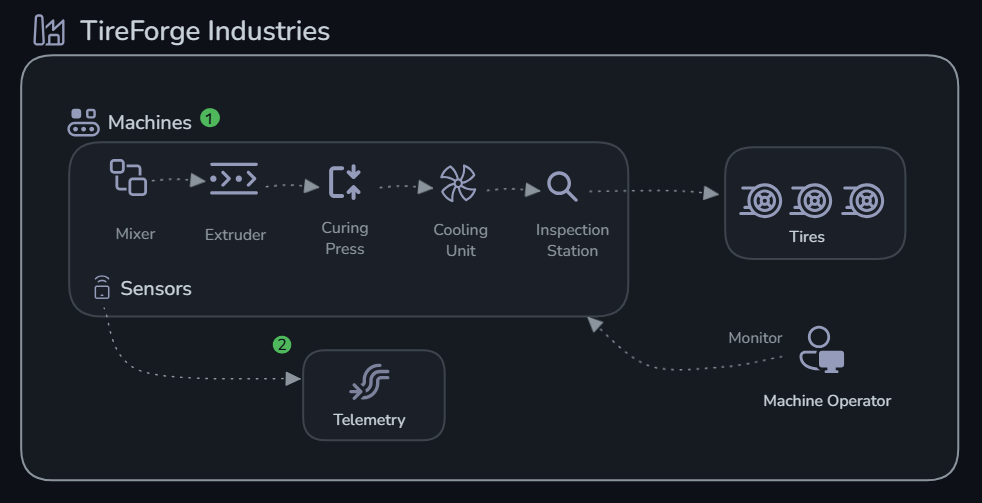

# 🏭 Scenario: Predictive Maintenance — TireForge Industries

## Background

**TireForge Industries** operates a tire manufacturing plant with 5 critical machines:

- **MX-001** (Mixer) — Blends raw rubber compounds
- **EX-002** (Extruder) — Shapes rubber into tire tread profiles
- **CP-003** (Curing Press) — Vulcanizes tires under heat and pressure
- **CU-004** (Cooling Unit) — Gradually cools cured tires
- **IS-005** (Inspection Station) — Quality assurance via vibration analysis

Each machine emits real-time sensor data: temperature, pressure, vibration, and RPM.

## Your Mission

Build an AI agent system that:

1. **Detects anomalies** — Compares sensor readings against thresholds
2. **Diagnoses faults** — Reasons about root causes from anomaly patterns
3. **Reports health** — Produces a consolidated factory health report

## Challenges

| # | Challenge | What You'll Do | Time |
|---|-----------|---------------|------|
| 0 | [Setup](./challenge-0-setup/README.md) | Deploy Microsoft Foundry infrastructure | 20 min |
| 1 | [Build Agents](./challenge-1-build/README.md) | Create Anomaly Detection + Fault Diagnosis agents | 30 min |
| 2 | [Monitor](./challenge-2-monitor/README.md) | Enable GenAI tracing with Application Insights | 20 min |
| 3 | [Evaluate](./challenge-3-evaluate/README.md) | Run systematic quality evaluations | 30 min |
| 4 | [Production Workflow](./challenge-4-deploy/README.md) | Multi-agent orchestration + portal workflow | 20 min |

## Why the Challenges Are in This Order

**Build first.** An agent with a vague system prompt or missing tools will hallucinate plausible-sounding diagnoses. For a tire manufacturing plant, that's not an academic problem — it means maintenance crews chasing phantom faults, or missing real ones until a machine fails mid-shift. The `check_thresholds` tool grounds the Anomaly Agent in actual machine specs, not general LLM knowledge about what "normal" vibration looks like for an extruder.

**Then monitor.** When the Fault Diagnosis Agent recommends pulling CP-003 offline, did it actually examine the sensor readings you fed it? Did `check_thresholds` get called, or did the agent reason from context alone? Application Insights traces answer that. Without them, the only signal you have is a machine failure that should have been caught earlier.

**Then evaluate.** Tracing tells you the agent ran. Evaluation tells you it ran correctly. The curated test dataset gives you a repeatable score to compare before and after any prompt change or model swap — so you catch regressions before they reach the production floor.

**Then deploy.** The portal workflow turns what you built in scripts into something the maintenance team can actually hand off: a stable endpoint, a per-shift factory health report, and a trace history for every diagnosis. That's the gap between a demo and a tool someone will actually trust before scheduling an unplanned maintenance window.

## Architecture

## Next Steps

Completing these challenges gives you a working multi-agent system with observability and evaluation in place. Here are the directions you can take it further:

**Deploy as a hosted agent endpoint**
Microsoft Foundry can host your agents as persistent, scalable API endpoints — no infrastructure to manage. Once hosted, any system (a SCADA dashboard, a mobile maintenance app, a Slack bot) can send a machine ID and receive a diagnosis in real time, rather than running a Python script manually.

**Add more tools to your agents**
The `check_thresholds` function in this lab uses local mock data. In production you’d replace it with tools that call real systems:
- A `fetch_maintenance_history` tool querying your CMMS (e.g. SAP PM, IBM Maximo) for past failures on that machine
- A `lookup_spare_parts` tool checking inventory availability before recommending a replacement
- A `create_work_order` tool that automatically opens a ServiceNow ticket when the Fault Diagnosis Agent flags a critical issue

**Build a knowledge base**
Upload TireForge’s machine manuals, supplier spec sheets, and historical incident reports to a Microsoft Foundry knowledge base. Attach it to the Fault Diagnosis Agent as a File Search tool so its recommendations are grounded in documented procedures rather than general LLM knowledge.

**Integrate evaluations into CI/CD**
Run your evaluation dataset automatically on every pull request or deployment. If the coherence or relevance score drops below a threshold (e.g. 3.5 out of 5), block the release. This prevents a system prompt edit or model update from silently degrading diagnosis quality in production.

**Explore advanced agent patterns**
- **Parallelise** the anomaly checks across all 5 machines simultaneously instead of sequentially
- **Add confidence thresholds** — if the Anomaly Detection Agent is uncertain, escalate to a human operator rather than passing to Fault Diagnosis automatically
- **Human-in-the-loop** — for critical faults, require a maintenance engineer to approve the recommended action before it triggers a work order

**Fine-tune for your domain**
Use your evaluation results to identify systematic errors — machines the agent consistently misclassifies or fault types it handles poorly. Use those cases to refine system prompts, add targeted few-shot examples, or fine-tune the underlying model on TireForge-specific sensor patterns.
